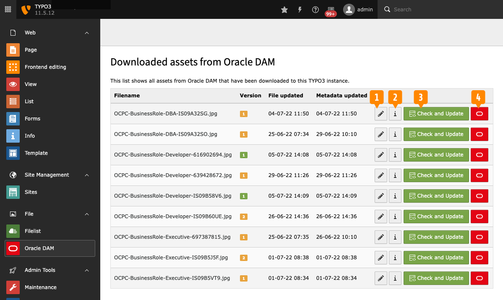

.. include:: /Includes.rst.txt

.. _admin-module:

=====================
Administration Module
=====================

The extension includes the *Oracle DAM* backend module, which is accessible to
all TYPO3 Backend administrators.

The module lists all images that have been downloaded from Oracle DAM to TYPO3.

.. _admin-module-columns:

Table columns
=============

The list of images has five columns:

**Filename**
   The name of the file.

**Version**
   The version of the file currently downloaded from Oracle DAM. The version
   numbers are orange, but turn green if the file has been uploaded in the last
   24 hours.

**File updated**
   The time when a new version of the file was downloaded from Oracle DAM.

**Metadata updated**
   The time when the metadata was last downloaded from Oracle DAM.

The fifth colum contains four action buttons.

.. _admin-module-buttons:

Action buttons
==============

**1: Edit metadata**
   Edit the TYPO3 metadata record for the file. Please note that *Title*,
   *Alternative text*, and *Caption* are overwritten when downloading updated
   metadata from Oracle DAM.

**2: File information**
   Display information about the file in TYPO3. Also lists records using the
   image.

**3: Check and Update**
   Checks for a new version of the file in Oracle DAM. If a new version is
   found, it is downloaded to TYPO3. Clicking this button also updates the
   metadata field *Title*, *Alternative text*, and *Caption*.

**4: View in Oracle DAM**
   Opens a new tab displaying the the image in Oracle Content.
