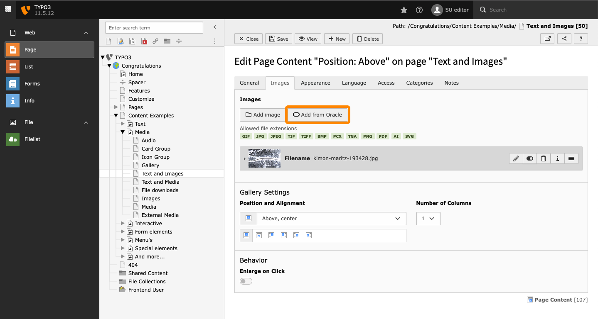
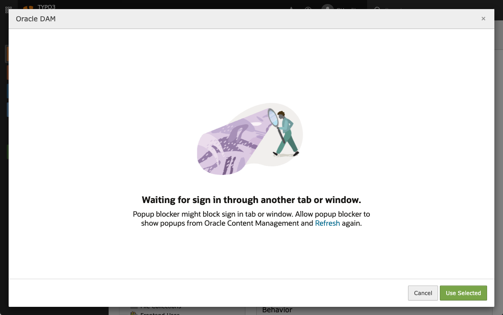

.. include:: /Includes.rst.txt

.. _editor:

==============
Editor's Guide
==============

.. _editor-add-images:

Add images from Oracle Content
==============================

The Oracle DAM integration introduces a new *Add from Oracle* button where you
select images in TYPO3, for example in the *Images* tab of a *Text & Images*
content element.

   The *Add from Oracle* button visible in the *Images* tab of a *Text & Images*
   content element.

.. _editor-selector:

The image selector
==================

Clicking the *Add from Oracle* button opens the image selector.

.. _editor-selector-login:

Signing in
----------

If you are not already logged in to Oracle, you will have to sign in.

   This screen will appear if you have not yet signed in to your Oracle account.

.. warning::

   If your browser is configured to block pop-up windows, the login window might
   not appear because it has been blocked. You will have to manually allow the
   pop-up.

.. _editor-selector-select:

Select images
-------------

   The image selector interface.

The image selector allows you to search for images and select one or more images
to use in TYPO3.

Once you have selected the image(s) you want, click the *Use Selected* button to
insert the images into the TYPO3 record you are editing.

.. note::

   It may take a few seconds for the image(s) to appear in TYPO3. This is
   because images that have not yet been used in the TYPO3 installation are
   downloaded from Oracle Content by TYPO3.
